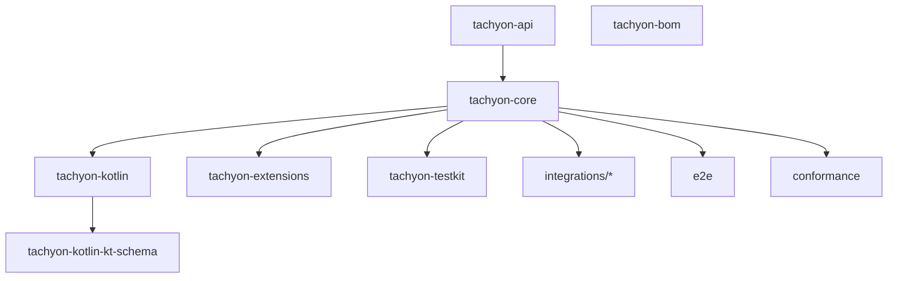

# 🛰️ Overview

Tachyon = MCP **server** library. Netty Streamable-HTTP transport, JSON-RPC, virtual-thread handlers. Java 21 first, Kotlin DSL on top. Speaks two MCP revisions at once: **2025-11-25** (session, `initialize`) and **2026-07-28** (stateless, per-request `_meta`). See [[protocol-versions]].

## 📦 Modules

Root `pom.xml` version `1.0.0-SNAPSHOT`. Java `21` (`pom.xml`), Kotlin `2.2.21` (`pom.xml`), Jackson **3** `3.2.2` (`pom.xml`, package `tools.jackson.*`), Netty `4.2.18.Final` (`pom.xml`).

| Module | Role | Page |
|---|---|---|
| `tachyon-api` | Public SAMs, descriptors, results, JSON SPI. No Netty. | [[tachyon-api]] |
| `tachyon-core` | Everything runtime | [[tachyon-core]] |
| `tachyon-kotlin` | DSL + coroutines | [[tachyon-kotlin]] |
| `tachyon-kotlin-kt-schema` | Reflection JSON-schema factory for Kotlin classes | [[tachyon-kotlin]] |
| `tachyon-extensions` | Skills extension, sample tools | [[tachyon-extensions]] |
| `tachyon-testkit` | HTTP test clients/asserts | [[tachyon-testkit]] |
| `integrations/*` | 6 modules (`pom.xml`) | [[integrations]] |
| `tachyon-bom` | `dependencyManagement` only | — |
| `e2e`, `conformance`, `reports` | profile-only modules (`pom.xml` `<profiles>`) | [[testing]] |

## 🎯 The one type users hold

`TachyonServer` interface `TachyonServer` — `AutoCloseable`, exposes registries `tools()/resources()/prompts()/tasks()/completions()`, `annotations(...)`, `notifications()`, `start()`, `port()`, `close()`. Factory `TachyonServer.builder()` → `DefaultServerBuilder` (`DefaultServerBuilder#network`).

Two-phase: `build()` constructs server + runs registrations, **no socket**; `start()` binds Netty.

## 🏗️ Build → start flow

1. `DefaultServerBuilder.build()` `DefaultServerBuilder#pipelineCustomizer`:
   - default in-memory `SessionEventStore` + `SessionStore`
   - tasks enabled ⇒ auto-add `TasksExtension` if absent
   - executor = `threadFactory` given ? thread-per-task : VT executor `tachyon-vt-*` (`DefaultTachyonServer#defaultExecutor`)
   - `new DefaultTachyonServer(...)` → run `withTools/withResources/...` callbacks → annotation providers → `validateConfiguration()`; any throw ⇒ `close()` + rethrow.
2. `DefaultTachyonServer` ctor `DefaultTachyonServer`: registries, `registerDefaults()` (`DefaultTachyonServer#registerDefaults`), `bootstrapExtensions()` (`DefaultTachyonServer#bootstrapExtensions`), change listeners (`DefaultTachyonServer#setupChangeListeners`), session janitor if sessions on.
3. `start()` `DefaultTachyonServer#start`: lifecycle `ReentrantLock`, `new NettyServer(this, NettyServerConfig…)`, record bound host/port.
4. `close()` `DefaultTachyonServer` → see [[concurrency]].

## 🧩 Internal seams

| Seam | Where | Page |
|---|---|---|
| `ServerEngine` (internal SPI, extends `TachyonServer`) | `ServerEngine` | [[tachyon-core]] |
| `RpcMethodHandler<I,O>` decode→handle | `RpcMethodHandler` | [[request-lifecycle]] |
| `Protocol` SPI (ServiceLoader) | `Protocol` | [[protocol-versions]] |
| `ProtocolRequestMapper` / `ProtocolResponseMapper` | `tachyon-core/src/main/java/dev/tachyonmcp/core/protocol/` | [[protocol-versions]] |
| `ServerExtension` | `ServerExtension` | [[extensions]] |
| `ObservationListener` | `ObservationListener` | [[observability]] |
| `SessionStore` / `SessionEventStore` | `tachyon-core/src/main/java/dev/tachyonmcp/core/server/session/` | [[sessions]] |
| `TaskConnector` | `TaskConnector` | [[tasks]] |

## 🔧 Build commands

`Makefile` targets: `build` (mvn verify), `test`, `lint`, `format`, `ci` = clean lint build revapi, `conformance`, `examples`, `mcp-inspector`. CI runs `make ci` (`.github/workflows/build.yml`). Details [[testing]].
