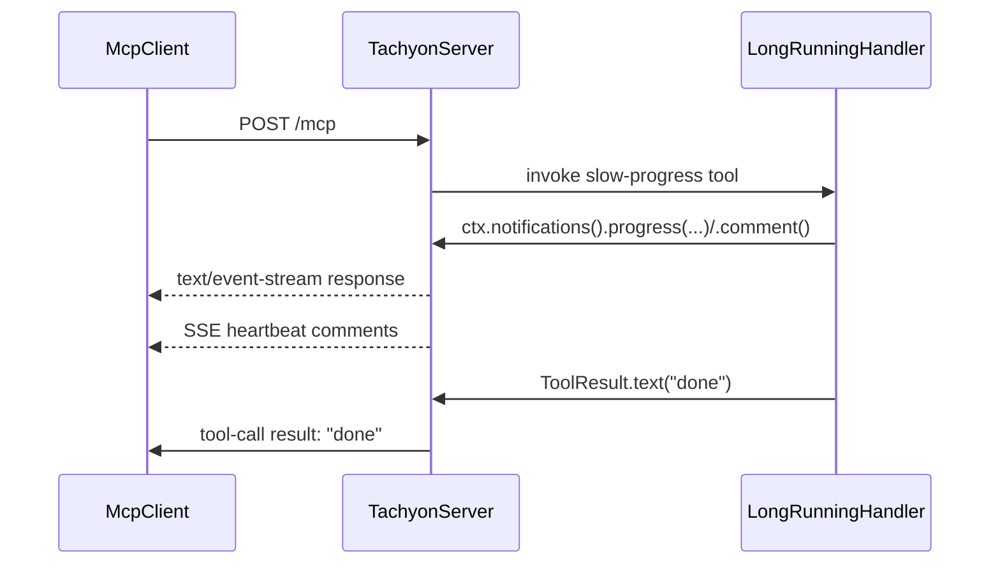

All configuration flows through `TachyonServer.builder()` (Java) or the `TachyonServer { }` DSL (Kotlin).

Java:
```java
var server = TachyonServer.builder()
    .info(i -> i.name("my-server").version("1.0"))
    .network(n -> n.port(8080).ioEngine(NettyIoEngine.AUTO))
    .session(s -> s.sessionTtl(Duration.ofMinutes(5)))
    .build();
server.start();
```

Kotlin:
```kotlin
val server = TachyonServer {
    info { name = "my-server"; version = "1.0" }
    network { port = 8080 }
    session { sessionTtl = 5.minutes }
}
```

## Network

Configured via `network { }` / `NetworkConfig.Builder`.

| Option | Default | Description |
|---|---|---|
| `host` | `127.0.0.1` | Bind address |
| `port` | — | Listen port; `0` picks a free port. Must be set before `start()` |
| `address` | — | Full `SocketAddress`; mutually exclusive with `host`/`port` |
| `endpointPath` | `/mcp` | HTTP endpoint path. Must start with `/`, no query, fragment or whitespace. Requests: a trailing `/` and the query string are ignored; any other path gets `404` |
| `readerIdleTimeout` | `60s` | Close connections with no inbound traffic for this long |
| `writerIdleTimeout` | `5m` | Close connections with no outbound traffic for this long |
| `heartbeatInterval` | `15s` | SSE heartbeat interval for silent listening streams; `<= 0` disables |
| `maxContentLength` | `1 MB` | Max aggregated HTTP request body |
| `ioEngine` | `AUTO` | Netty I/O transport, see below |

`.port(int)` is also available as a top-level `ServerBuilder` shortcut.

For `host`, `port` and hostname settings when the server runs on a platform, see
[deployment](deployment.md).

### Keep-alive for long-running tools



`readerIdleTimeout` closes connections that receive **no inbound bytes** for its duration,
unless an SSE stream has heartbeats enabled. After a client finishes sending a request it stays
silent while waiting for the reply, so this timer also runs while your handler is computing.
A tool that takes longer than `readerIdleTimeout` (default `60s`) must upgrade to SSE with
heartbeats before the timeout expires to keep its connection open.

> **Note:** Set `readerIdleTimeout` to `Duration.ZERO` to disable the inbound idle timeout.

Keep the stream alive with **SSE + heartbeats**. Any server→client message on the POST upgrades
the response from buffered JSON to `text/event-stream`.
With a positive `heartbeatInterval`, both initialization and operation handlers ignore
**reader**-idle events on the upgraded stream. This applies to sessionless `2026-07-28` requests and legacy
requests, including `initialize`. A fixed-rate scheduler emits a `:\r\n` comment every
`heartbeatInterval` (default `15s`). Heartbeats are outbound writes: they do not reset the
reader-idle timer. There are two ways to trigger the upgrade:

- **`progress(token, ...)`** — when the client requested progress (sent `_meta.progressToken`).
  Forward that token, exposed as `ToolRequest.progressToken()`. A `null` token is **silently
  dropped** per the MCP spec (the client didn't opt in) — no bytes are sent, so it does **not**
  upgrade the connection or keep it alive.
- **`comment(msg)`** — a token-free SSE comment (`: msg`). Use it to keep alive when no progress
  token is available, since a dropped `progress(null, ...)` sends nothing. `comment()` emits a
  bare `:` heartbeat.

The progress token is available only from `ToolRequest`, so override `handle(ctx, ToolRequest)` or
`handleAsync(ctx, ToolRequest)` when forwarding progress. `comment(...)` needs no token and is
available from any handler's `InteractionContext`:

```java
class SlowTool extends AbstractToolHandler {
    SlowTool() {
        super(ToolDescriptor.builder().name("slow-task").description("Long task, kept alive").build());
    }

    @Override
    public ToolResult handle(InteractionContext ctx, ToolRequest request) throws Exception {
        var token = request.progressToken();          // client _meta.progressToken; null if absent
        for (int i = 0; i < total; i++) {
            // First call upgrades POST → SSE and arms the heartbeat.
            if (token != null) {
                ctx.notifications().progress(token, i, total, "step " + i);
            } else {
                ctx.notifications().comment("step " + i);   // token-free keep-alive
            }
            doSlowStep(i);
        }
        return ToolResult.text("done");
    }
}
```

Guidance:

- No token available? Use `comment(...)` — it upgrades and keeps the stream alive without one.
  A `null`-token `progress(...)` call is silently dropped (no throw, no bytes sent, no upgrade).
- Keep `heartbeatInterval` below proxy/load-balancer idle timeouts and, for stateful streams,
  below the session TTL. The heartbeat interval does not need to beat `readerIdleTimeout`:
  reader idle is a no-op while heartbeats run.
- Keep `heartbeatInterval < writerIdleTimeout` (default `15s < 5m`). Writer idle still closes
  heartbeat streams, so it catches a stalled peer.
- Size `readerIdleTimeout` for **dead-peer detection** (how long a silent connection may live),
  not for how long a tool runs. Bumping it to cover a slow tool is the wrong lever — use the SSE
  keep-alive pattern above.
- `heartbeatInterval <= 0` disables heartbeats; silent SSE streams then close on idle. Lower it
  below any proxy/load-balancer idle timeout sitting in front of the server.

A peer that stops reading leaves the channel non-writable. Heartbeats skip non-writable channels,
so no write completes and the stream closes after `writerIdleTimeout`, with or without a session.
Set `writerIdleTimeout` to `Duration.ZERO` to disable that close.

### Reconnecting to an SSE stream

If the connection drops mid-call, a client with sessions enabled reconnects with
`Last-Event-ID` and Tachyon replays the events it missed. Two guarantees matter when you write
a tool:

- **Replay is per stream.** A resumed stream receives only the events of the stream it is
  resuming, never another stream's — the MCP resumability rule.
- **The final response survives the drop.** A tool's result reaches a client that reconnects
  after the stream closed, including when your handler closes its own stream before producing
  a result.

Neither needs configuration beyond enabling sessions, which
[Session](#session) covers. Replay reads from the session event store, so a custom
`SessionEventStore` participates in it.

### CORS

The [DNS-rebinding guard](#dns-rebinding-protection) runs first and admits loopback origins,
on any port, plus any listed in `allowedOrigins`. CORS then answers the browser, so a page
served from a dev server such as `http://localhost:5173` can call a local server. Only the
MCP endpoint answers: a preflight to any other path gets `404` and no CORS grant.

| Option | Default | Description |
|---|---|---|
| `allowedOrigins` | — (any loopback origin, answered `*`) | Exact `Origin` values the guard admits and CORS grants, answered with the origin and `Vary: Origin`. Once set, loopback origins not in the list are still admitted but get no CORS grant |
| `allowNullOrigin` | `false` | Grant `Origin: null` in CORS; the guard still rejects it, because any web page can send it from a sandboxed iframe |
| `allowPrivateNetworks` | `false` | Answer private-network CORS preflights |
| `allowedHeaders` | — | Request headers granted beyond the built-in ones |

Built in, with no configuration:

- Preflights grant `GET`, `POST` and `DELETE`.
- Preflights grant `Content-Type`, `Authorization`, `MCP-Protocol-Version`, `MCP-Session-Id`,
  `Last-Event-ID`, `Mcp-Method` and `Mcp-Name`, plus each per-tool `Mcp-Param-*` header the
  preflight asks for, by name. There is no wildcard: any other header needs `allowedHeaders`.
- Responses expose `MCP-Session-Id` and `MCP-Protocol-Version` to script.
- Browsers may cache a preflight for up to a day.
- Credentials are never allowed.

A POST must send `Content-Type: application/json`, or the server answers `415 Unsupported
Media Type` with a JSON-RPC `-32600` error and `"id": null`, since the body is never read. Browsers send `text/plain`, form and multipart bodies without a preflight, so
this rule keeps every browser request behind CORS.

### DNS-rebinding protection

Every request's `Host` (and, when present, `Origin`) header must resolve to
`localhost`/`127.0.0.1`, or the connection is rejected with `403 Forbidden`. `allowedHosts`
extends the `Host` check with additional authorities — e.g. a container reaching the server
via `host.docker.internal`. It does **not** widen the `Origin` check: a browser page on a
non-local origin is rejected unless that origin is in [`allowedOrigins`](#cors).

| Option | Default | Description |
|---|---|---|
| `allowedHosts` | — (localhost-only) | Extra `Host` authorities (`host` or `host:port`) accepted beyond localhost |

```java
.network(n -> n.allowedHosts("host.docker.internal:8096"))
```

```kotlin
network { allowedHosts += "host.docker.internal:8096" }
```

Entries are bare authorities, not URLs, matched case-insensitively; an entry without a port
matches that host on any port. See `DnsRebindingProtectionHandler`'s class docs for exact
matching rules (bracketed IPv6, multiple/missing `Host` headers, HTTP/1.0 exemption).

A server behind a public hostname must add that hostname here or every request through it is
rejected. See [deployment](deployment.md#3-public-hostname).

### `Mcp-Param-*` character restrictions

On a `2026-07-28` request, a literal (non-Base64) `Mcp-Param-*` value may contain only
horizontal tab, space, and visible ASCII (`0x21`–`0x7E`); anything else is rejected with `400`
and JSON-RPC `-32020` (HeaderMismatch). Per SEP-2243 clients must Base64-wrap such values as
`=?base64?{value}?=` instead. Every `Mcp-Param-*` header on the request is checked, whether or
not it maps to an `x-mcp-header` tool argument.

Netty's decoder already rejects NUL/CR/LF, but decodes `0x80`–`0xFF` as ISO-8859-1 and passes
it through — that non-ASCII case is what this check catches.

### MCP header guard

Two request shapes let the HTTP view of a request and the executed view disagree. Both are
rejected with `400 Bad Request` before the body is read, and the connection is closed. Not
configurable.

**Duplicate singleton headers.** `MCP-Protocol-Version`, `MCP-Session-Id`, `Mcp-Method`,
`Mcp-Name`, `Last-Event-ID`, and any `Mcp-Param-*` carry exactly one value. Repeating one lets
the server and an intermediary read different values from the same request — the SEP-2243
routing headers exist precisely so a gateway can decide without parsing the body, which only
holds while both views agree. Repeating `MCP-Protocol-Version` is a downgrade: the server
negotiates the first value while a proxy reading the last one believes a newer revision applied.

Duplicates are rejected even when both values are identical, since an intermediary can still
disagree about whether the field is singular. Repeatable headers (`Accept`, `Cookie`, …) are
untouched.

**Mirrored headers without `MCP-Protocol-Version: 2026-07-28`.** `Mcp-Method`, `Mcp-Name` and
`Mcp-Param-*` are only compared against the body by the `2026-07-28` revision. A request naming
an older version — or omitting the header entirely — would carry them uninspected, so
`Mcp-Method: tools/list` could clear a gateway while the body ran `tools/call`. The mirrors were
introduced by `2026-07-28`, so no legitimate older client sends them.

## I/O engine

`NettyIoEngine` selects the Netty transport:

| Engine | OS | Runtime dependency |
|---|---|---|
| `AUTO` (default) | any | picks best available, in order below |
| `IO_URING` | Linux 5.9+ | `netty-transport-native-io_uring` |
| `EPOLL` | Linux | `netty-transport-native-epoll` |
| `KQUEUE` | macOS / BSD | `netty-transport-native-kqueue` |
| `NIO` | any | none (bundled) |

`AUTO` detection order: io_uring → epoll → kqueue → NIO. Detection happens once and is cached; the chosen engine is logged at startup:

```text
Netty I/O engine: KQUEUE
```

Native transports are optional runtime dependencies — `tachyon-core` itself depends only on the portable NIO transport. To enable a native transport, add the matching jar with your platform classifier (via [os-maven-plugin](https://github.com/trustin/os-maven-plugin)):

```xml
<build>
    <extensions>
        <extension>
            <groupId>kr.motd.maven</groupId>
            <artifactId>os-maven-plugin</artifactId>
            <version>1.7.1</version>
        </extension>
    </extensions>
</build>

<profiles>
    <profile>
        <id>netty-native-linux</id>
        <activation>
            <os><name>linux</name></os>
        </activation>
        <dependencies>
            <dependency>
                <groupId>io.netty</groupId>
                <artifactId>netty-transport-native-epoll</artifactId>
                <version>${netty.version}</version>
                <classifier>${os.detected.classifier}</classifier>
                <scope>runtime</scope>
            </dependency>
        </dependencies>
    </profile>
    <profile>
        <id>netty-native-mac</id>
        <activation>
            <os><family>mac</family></os>
        </activation>
        <dependencies>
            <dependency>
                <groupId>io.netty</groupId>
                <artifactId>netty-transport-native-kqueue</artifactId>
                <version>${netty.version}</version>
                <classifier>${os.detected.classifier}</classifier>
                <scope>runtime</scope>
            </dependency>
        </dependencies>
    </profile>
</profiles>
```

See [`examples/weather-mcp/pom.xml`](https://github.com/tachyonmcp/tachyon/blob/main/examples/weather-mcp/pom.xml)
for a complete working setup.

Requesting an explicit engine whose transport is not on the classpath (or not supported by the OS) throws `UnsupportedOperationException` at startup, with Netty's unavailability cause in the message:

```java
network(n -> n.ioEngine(NettyIoEngine.EPOLL)) // fails fast on macOS
```

```kotlin
network { ioEngine = NettyIoEngine.EPOLL }
```

## Session

Configured via `session { }` / `SessionConfig.Builder`. Stateless is a property of the **server**,
not of a session — a stateless server simply keeps no sessions, and that is the default.
**Configuring a session option is the opt-in**: setting `sessionTtl`, `janitorInterval`,
`sessionStore`, `sessionEventStore` or `sessionIdGenerator` turns sessions on by itself. `enabled()`
turns them on with the defaults, and `stateless()` writes the opt-out down. A stateless server keeps
no session state: `SessionStore.noop()` and `SessionEventStore.noop()` persist nothing.

```java
.session(s -> s.sessionTtl(Duration.ofMinutes(5)))   // sessions on, custom TTL
.session(s -> s.enabled())                           // sessions on, all defaults
.stateless()                                         // explicitly stateless (the default)
```

```kotlin
session { sessionTtl = 5.minutes }   // sessions on, custom TTL
session { enable() }                 // sessions on, all defaults
stateless()                          // explicitly stateless (the default)
```

Turning sessions off while a session option is configured is the one contradiction the API still
accepts, and it fails fast: `IllegalStateException` at build time.

| Option | Default | Description |
|---|---|---|
| `enabled` | `false` | Server-side sessions are off by default (stateless server). Configuring any option below enables them; `enabled()` (Java) or `enable()` (Kotlin) enables them with defaults; `stateless()` on the server builder is the explicit opt-out. The boolean `SessionConfig.Builder.enabled(boolean)` overload and the Kotlin `enabled` property are deprecated |
| `sessionTtl` | `30s` | Idle sessions are evicted after this duration |
| `janitorInterval` | `5s` | Janitor sweep interval; controls how often expired sessions are checked |
| `sessionEventStore` | in-memory when enabled, no-op when off | Experimental custom session event store |
| `sessionStore` | in-memory when enabled, no-op when off | Experimental immutable session snapshot store |
| `sessionIdGenerator` | `sess_<uuid>` | Custom hook for deriving session ids from the initialize `HttpRequest` (headers/URI) |

Live `Session` objects remain internal and process-local. `SessionStore` persists immutable,
transport-free `SessionSnapshot` values. `SessionEventStore` persists replay events. These
experimental stores enable restart recovery, but do not distribute live sessions or transport
connections between nodes.

A persistent implementation can use the session ID as its key and encode the complete snapshot
as its value. `create` is an atomic put, `find` decodes the value, `compareAndSet` is a conditional
replace, `touch` conditionally extends the matching generation's expiry, and `terminate` removes
only the matching generation. Store implementations must make these operations thread-safe.
Operations execute synchronously and may perform I/O. Tachyon invokes them outside transport
event-loop threads. Implementations must be thread-safe.

## Runtime

Configured via `runtime { }` / `RuntimeConfig.Builder`.

| Option | Default | Description |
|---|---|---|
| `shutdownGracePeriod` | `5s` | Shared time budget to drain admitted requests through handler completion and transport finalization, then terminate the executor on `close()`; `ZERO` interrupts immediately |
| `requestTimeout` | `60s` | Timeout for pending requests sent to the client |
| `clock` | `Clock.systemUTC()` | Clock for task timestamps and TTL/expiry checks; set a fixed or controllable clock in tests |

Shutdown rejects new dispatches while draining, answering them with `503 Service Unavailable`. The executor remains available for asynchronous continuations during the grace period. Subscriptions, extensions, sessions, and event storage are torn down after draining completes or the grace period expires. Unfinished asynchronous stages can outlive that deadline.

`close()` blocks its calling thread until draining finishes, and draining needs the I/O event loops to flush in-flight responses — so calling it from an event loop throws `IllegalStateException` rather than stalling for the whole grace period.

## Observability

Configured via Java `ObservabilityConfig.Builder` / Kotlin `observability { }`. Slow-request
diagnostics and payload capture are off by default. Observation listeners are empty by default.

| Option | Default | Description |
|---|---|---|
| `slowRequestLogging` | `false` | Enable slow-request diagnostics (handler watchdog + slow-POST logging) |
| `slowRequestThreshold` | `10s` | Requests exceeding this duration produce a `warn` log when logging is enabled |
| `listener` | none | Registers a passive `ObservationListener` (spans, metrics, logs) |
| `payloadCapture` | all off | Opt-in request/response/exception content capture |

See [Observability](observability.md) for the `ObservationListener` contract, the payload
capture policy's individual toggles, and the bundled OpenTelemetry integration.

Turning `slowRequestLogging` on activates two diagnostics:
- **Handler watchdog** — a scheduled timer logs `"Handler slow"` at `debug` level when a handler exceeds the threshold
- **Slow-POST logging** — `completePostRequest` logs `"Slow POST response"` at `warn` level when the full request cycle exceeds the threshold

Both share the same threshold and are silenced at default (flag off, zero overhead).

```java
var server = TachyonServer.builder()
    .observability(o -> o.slowRequestLogging().slowRequestThreshold(Duration.ofSeconds(5)))
    .port(8080)
    .build();
server.start();
```

```kotlin
TachyonServer(port = 8080) {
    observability {
        slowRequestLogging(threshold = 5.seconds)
    }
}
```

Use `observability(...)` in Java and `observability { }` in Kotlin. The older `monitoring`
aliases are deprecated for removal — migrate any code still calling them.

## Identity

`info { }` sets the `serverInfo` returned by `initialize` (name, version, title, etc.); `.name(String)` is a top-level shortcut. See [quickstart](../quickstart.md) for a full example.

## Capabilities

Configured via `capabilities { }` / `CapabilitiesConfig.Builder`. Each MCP capability has its own
config type, nested under `capabilities`: `tools` and `prompts` share `FeatureConfig`
(`mode`, `listChanged`, `pageSize`); `resources` uses `ResourcesConfig` (adds `subscribe`); `tasks`
uses `TasksConfig`, which binds the external `TaskConnector` and server-side projection settings.
The legacy `list` flag and modern `cancel`/`requests` flags are derived from that connector.

| Sub-config | Fields | Default |
|---|---|---|
| `tools` / `prompts` (`FeatureConfig`) | `mode`, `listChanged`, `pageSize` | `AUTO`, `false`, `50` |
| `resources` (`ResourcesConfig`) | `mode`, `listChanged`, `pageSize`, `subscribe` | `AUTO`, `false`, `50`, `false` |
| `tasks` (`TasksConfig`) | `enabled`, `connector`, derived `list`/`cancel`/`requests`, `pageSize`, `keepAlive`, `pollInterval` | `false`, none, `50`, `5m`, none |
| — | `completions`, `logging` | `AUTO`, `false` |

`mode`:
- **`AUTO`** (default) — advertised only once a handler of that type is registered. No config needed for the common case.
- **`ON`** — advertised from `initialize`, even with zero handlers registered yet (needed for dynamic registration + `list_changed` after startup).
- **`OFF`** — never advertised, **and registration becomes a no-op**: `tools().register(...)`, `resources().register(...)`, and `prompts().register(...)` are silently skipped (logged at `debug`).

`tasks.enabled` works the same as `mode == ON` for tools/resources/prompts, except the `tasks`
capability is *also* advertised — regardless of `enabled` — whenever a registered tool declares
task augmentation support (`ToolDescriptor.taskSupport()`).

```java
var server = TachyonServer.builder()
    .capabilities(c -> c
        .tools(FeatureConfig.builder().mode(Mode.ON).listChanged(true).build())
        .resources(ResourcesConfig.builder().mode(Mode.ON).subscribe(true).build())
        .tasks(TasksConfig.builder().enabled(true).connector(taskConnector).build())
        .completions()
        .logging())
    .port(8080)
    .build();
server.start();
```

```kotlin
TachyonServer(port = 8080) {
    capabilities {
        tools { mode = Mode.ON; listChanged = true }
        resources { mode = Mode.ON; subscribe = true }
        tasks(taskConnector)
        completions = true
        logging = true
    }
}
```

Java also keeps the pre-nesting flat setters and convenience shortcuts (`.tools()`,
`.tools(listChanged)`, `.noTools()`, `.toolsPageSize(n)`, and the `resources`/`prompts`/`tasks`
equivalents) — they mutate the same nested sub-config, so chaining still works:
`c.tools().toolsPageSize(20)` sets `mode = ON` and `pageSize = 20` on the same `FeatureConfig`.

## Advanced

| Option | Description |
|---|---|
| `threadFactory(ThreadFactory)` | Thread factory for the server-owned virtual-thread-per-task executor (default: `Thread.ofVirtual().name("tachyon-", 0)`) |
| `pipelineCustomizer(Consumer<ChannelPipeline>)` | Hook to mutate the Netty pipeline after MCP handlers are installed |
| `json(cfg -> cfg.inputSchemaValidator(...).outputSchemaValidator(...))` | Custom JSON Schema validators |

## Examples

Runnable servers, each built in CI:

| Example | Language | Shows |
|---|---|---|
| [`echo-kotlin`](https://github.com/tachyonmcp/tachyon/tree/main/examples/echo-kotlin) | Kotlin | Smallest viable server: `buildServer { }`, in-DSL and post-build tool registration |
| [`weather-mcp`](https://github.com/tachyonmcp/tachyon/tree/main/examples/weather-mcp) | Java | Tool with progress and elicitation, static and async resources, template, prompt, completions, sessions, OpenTelemetry |
| [`weather-mcp-kotlin`](https://github.com/tachyonmcp/tachyon/tree/main/examples/weather-mcp-kotlin) | Kotlin | The same surface through the Kotlin DSL, with kotlinx.serialization |
| [`mcp-java`](https://github.com/tachyonmcp/tachyon/tree/main/examples/mcp-java) | Java | `@Tool`/`@Resource`/`@Prompt` annotations via `McpJavaAnnotationProvider` |
| [`langchain4j-mcp`](https://github.com/tachyonmcp/tachyon/tree/main/examples/langchain4j-mcp) | Java | LangChain4j `@Tool` methods returning records as `structuredContent` |
| [`mcp-skills`](https://github.com/tachyonmcp/tachyon/tree/main/examples/mcp-skills) | Java | `SkillsExtension` with classpath and filesystem registries |
| [`temporal`](https://github.com/tachyonmcp/tachyon/tree/main/examples/temporal) | Java | MCP tasks backed by Temporal workflows |

Each is a standalone Maven project with its own wrapper; every one reads `HOST`, `PORT` and
`ALLOWED_HOST` from the environment. See
[`examples/README.md`](https://github.com/tachyonmcp/tachyon/blob/main/examples/README.md) for
the per-example commands.

For a single file that exercises every builder option in one place, see
[`ConfigReference.java`](https://github.com/tachyonmcp/tachyon/blob/main/.agents/skills/tachyon-mcp/resources/java/ConfigReference.java).
It is compiled as part of the build, so it cannot drift from the API.
